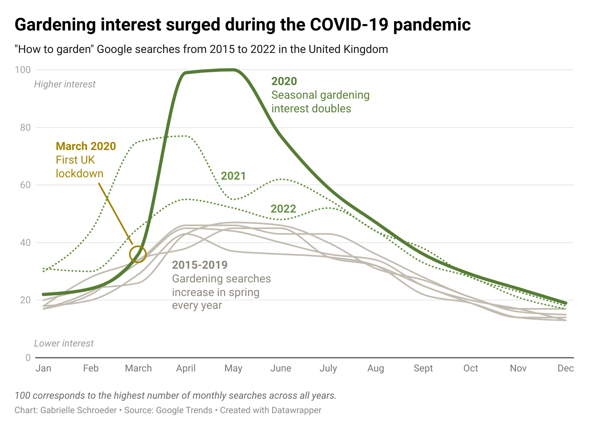

# Gardening Google Trends
*Small project to practice using R and Datawrapper.*

## Write-up and Datawrapper visualisations

With the weather warming up in Newcastle upon Tyne, I’ve been spending more time in our new garden. As a novice gardener, I’ve also been doing more research online, Googling how and when to plant my various vegetable and flower seeds. These searches made me wonder how other gardeners use Google. Do their searches also vary over the course of the year?

Using Google Trends data, I began investigating garden searches in the UK, focusing on “how to garden” to capture interest in hobby gardening. I soon found that the expected seasonal changes weren’t the most interesting pattern in recent years: 

<a href = "https://www.datawrapper.de/_/V90Wd/">

*Click on the chart for an interactive version*

Compared to the previous five years, **2020 saw more than double the number of "how to garden" searches** after the first UK COVID-19 lockdown. In hindsight, the increased searches during 2020 are unsurprising, as **[the COVID-19 pandemic saw a dramatic increase in hobbiest gardeners](https://www.mind.org.uk/news-campaigns/news/over-7-million-have-taken-up-gardening-since-the-pandemic-new-research-shows-spending-more-time-in-nature-has-boosted-nation-s-wellbeing/).** Like the pandemic, this higher interest persisted into 2021, with 2022 also seeing somewhat elevated searches. Interestingly, 2021 also bucks the usual seasonal pattern: “how to garden” searches increased a month earlier than expected, suggesting that gardeners were eager to get back outdoors after a winter of lockdowns!

I can think of two main possibilities for the increased gardening interest:
* **People looking for new at-home hobbies** for themselves or their families. Many people had more free time due to furlough or working from home, and many usual hobbies and social activities were restricted by lockdowns.
* **People who wanted access to fresh food** without risking exposure to COVID-19 in shops or dealing with [strange grocery delivery substitutions](https://www.theguardian.com/business/2023/mar/25/strawberries-instead-of-bin-liners-poll-reveals-strange-supermarket-delivery-substitutions). 
  
To better understand what drove the pandemic gardening Google searches, I investigated two more specific search terms: "how to grow vegetables" and "how to grow flowers."
  
 <a href = "https://www.datawrapper.de/_/QCtih/">
  
Both of these searches also dramatically increased during the first year of lockdowns. Although some flowers are [edible](https://www.gardenersworld.com/how-to/grow-plants/how-to-grow-nasturtiums/) or [good companion plants](https://www.gardenersworld.com/plants/10-companion-plants-to-grow/), we can probably assume that flower searches were mostly hobby-motivated. Growing vegetables can also primarily be a hobby, but, interestingly, vegetable searches increased both sooner and more than flower searches in 2020. While home-grown crops take time to bear fruit (or veg), some searches may have been driven by initial lockdown fears or food order frustrations - especially if people suspected the pandemic would last beyond the first three week lockdown.

## Stand-alone R visualisation

 

*Compared to the above plots, I've added a third, more generic search: "how to grow food." Food searches also increased during COVID, suggesting at least some gardening interest was driven by people who wanted to grow their own food.*
